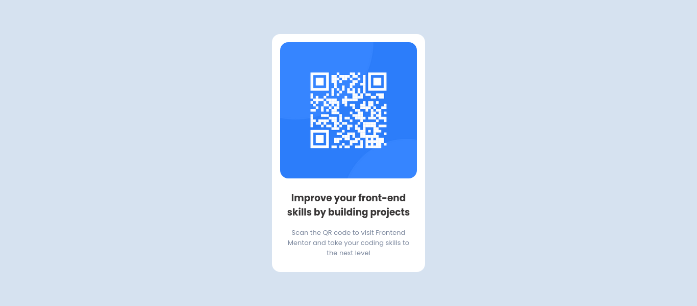

# Frontend Mentor - QR code component solution

This is a solution to the [QR code component challenge on Frontend Mentor](https://www.frontendmentor.io/challenges/qr-code-component-iux_sIO_H). Frontend Mentor challenges help you improve your coding skills by building realistic projects. 

## Table of contents

- [Overview](#overview)
  - [The challenge](#the-challenge)
  - [Screenshot](#screenshot)
  - [Links](#links)
- [My process](#my-process)
  - [Built with](#built-with)
  - [Useful resources](#useful-resources)
- [Author](#author)

## Overview

### The challenge
The challenge is to build out this QR code component and get it looking as close to the design as possible.
You can use any tools you like to help you complete the challenge. So if you've got something you'd like to practice, feel free to give it a go.

### Screenshot

### Links

- Solution URL: [Frontend Mentor Solution](https://www.frontendmentor.io/solutions/qr-code-component-ZgBqdkEjqw)
- Live Site URL: [Live Preview](https://deltanode.github.io/frontend-mentor-challenges/qr-code-component/)

## My process

### Built with

- Semantic HTML5 markup
- CSS custom properties
- Flexbox
- Mobile-first workflow

<!-- 
### What I learned

Use this section to recap over some of your major learnings while working through this project. Writing these out and providing code samples of areas you want to highlight is a great way to reinforce your own knowledge.
-->

### Useful resources

- [Figma](https://www.figma.com/) - Paste your design image to check the size of containers, width, etc.
- [Perfect Pixel](https://chrome.google.com/webstore/detail/perfectpixel-by-welldonec/dkaagdgjmgdmbnecmcefdhjekcoceebi) - Awesome Chrome extension that helps you to match the pixels of the provided design.

## Author

- Github - [Yogesh Yadav](https://github.com/deltanode)
- Frontend Mentor - [@yogesh7132](https://www.frontendmentor.io/profile/yogesh7132)
- Twitter - [@yogesh_yadv](https://twitter.com/yogesh_yadv)
